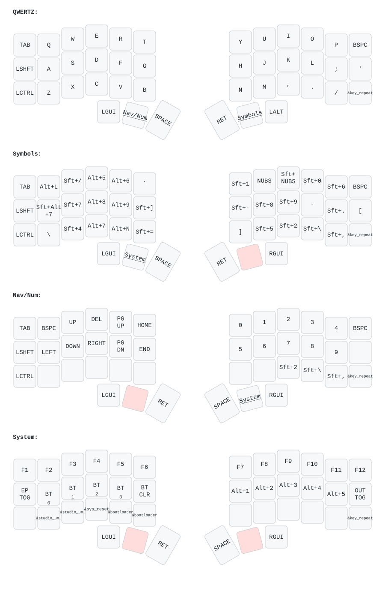

# Corne Wireless — Custom ZMK Firmware

## Keymap Layout

  

---

## Dual-OS Support (Windows & macOS)

The keyboard defaults to **Windows German (DIN AltGr)** on startup. You can switch between Windows and macOS on the fly:

1. Hold both inner thumb keys to enter the **System layer**.
2. Press **`MAC`** (Row 3, Col 9) to switch to macOS mode, or **`WIN`** (Row 3, Col 8) to return to Windows mode.
3. The left OLED display immediately updates to reflect the active OS (`Windows` or `macOS`).

### Muscle Memory

| Symbol | Physical Position | Windows (Default) | macOS (Toggled) |
| :--- | :--- | :--- | :--- |
| **`@`** | Top row, Col 2 | `AltGr + Q` (`RA(Q)`) | `Option + L` (`LA(L)`) |
| **`\`** | Middle row, Col 2 | `AltGr + ß` (`RA(MINUS)`) | `Shift + Option + 7` (`LS(LA(N7))`) |
| **`[`** / **`]`** | Top row, Col 4 & 5 | `AltGr + 8 / 9` (`RA(N8)` / `RA(N9)`) | `Option + 5 / 6` (`LA(N5)` / `LA(N6)`) |
| **`{`** / **`}`** | Middle row, Col 4 & 5 | `AltGr + 7 / 0` (`RA(N7)` / `RA(N0)`) | `Option + 8 / 9` (`LA(N8)` / `LA(N9)`) |
| **`\|`** | Bottom row, Col 4 | `AltGr + <` (`RA(NUBS)`) | `Option + 7` (`LA(N7)`) |
| **`~`** | Bottom row, Col 5 | `AltGr + +` (`RA(RBKT)`) | `Option + N` (`LA(N)`) |

---

## Layer Architecture

The 42-key (3×6+3) layout is structured into intuitive layers designed for programming ergonomics and German input:

### 1. Base Layer (`Windows` [Default] / `macOS` [Toggled])
- **German Typing**: Native QWERTZ arrangement with dedicated Umlauts (`Ä`, `Ö`) and physical swap of `Y` / `Z` scancodes for standard German OS input.
- **Escape Key**: Home-row pinky position (`ESC`) on the bottom-right corner for fast access.
- **Thumb Cluster**:
  - **Left**: `LGUI` (Windows key / Command), `mo 3` (Nav/Num Layer), `Space`
  - **Right**: `Return` (Enter), `mo 2` / `mo 4` (Symbols Layer), `LALT` (Alt / Option)

### 2. `Symbols` (Right Thumb)
- **Developer First**: Direct access to brackets, braces, and operators without awkward modifier gymnastics.
- **Top Row**: `@` `_` `[` `]` `^` | `!` `<` `>` `=` `&` `Backspace`
- **Middle Row**: `\` `/` `{` `}` `*` | `?` `(` `)` `ß` `:` `Ü`
- **Bottom Row**: `#` `$` `|` `~` `` ` `` | `+` `%` `"` `'` `;` `Repeat`

### 3. `Nav/Num` (Left Thumb `mo 3`)
- **Navigation Cluster**: Full inverted-T arrow cluster (`Up`, `Down`, `Left`, `Right`) plus `Page Up`, `Page Down`, `Home`, and `End` on the left hand.
- **Number Pad**: Numbers `0` through `9` ergonomically clustered on the right hand.
- **Corner Action**: Dedicated Delete (`DEL`) key on the bottom-right corner.
- **Thumb Keys**: Instant `Return` and `Space` access while navigating.

### 4. `System` (Hold Both Layer Thumbs `mo 5`)
- **Function Keys**: `F1` through `F12` across the top row.
- **OS Mode Switcher**: `WIN` (`&to 0`) and `MAC` (`&to 1`) on the bottom row.
- **Repeat Key**: Repeat shortcut (`&key_repeat`) on the bottom-right corner.
- **Bluetooth Controls**: Switch between 4 paired devices (`BT0`–`BT3`), clear bond (`BT Clear`), and toggle USB/BLE output mode (`OUT_TOG`).
- **Hardware Power**: External power rail toggle (`EP_TOG`) for OLED VCC power saving.
- **Firmware Maintenance**: Hardware `Reset`, `Bootloader` triggers, and `ZMK Studio Unlock`.

---

## Custom Dual OLED Displays

| Left Screen (Central) | Right Screen (Peripheral) |
|:---:|:---:|
| **ZMK Status Dashboard** | **Cyberpunk Neuromancer Logo** |
| Active Layer name (`Windows`, `macOS`, `Symbols`, etc.) | High-contrast 128×32 1-bit bitmap |
| Battery percentage & charging indicator | Inverted for SSD1306 monochrome screen |
| Bluetooth connection & profile status | Rotated 180° for right-half orientation |
| Real-time WPM counter & USB status | Hardware-rendered via Zephyr LVGL |

Display logic is implemented in [`src/custom_status_screen.c`](src/custom_status_screen.c) and [`src/neuromancer_img.c`](src/neuromancer_img.c).
(artwork by: https://gist.github.com/fferrin)
